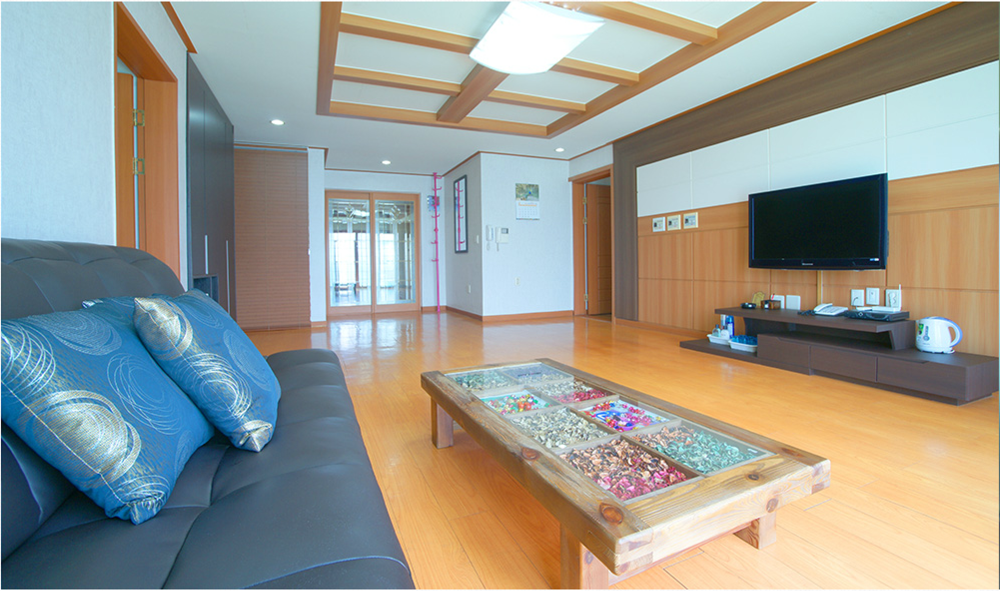
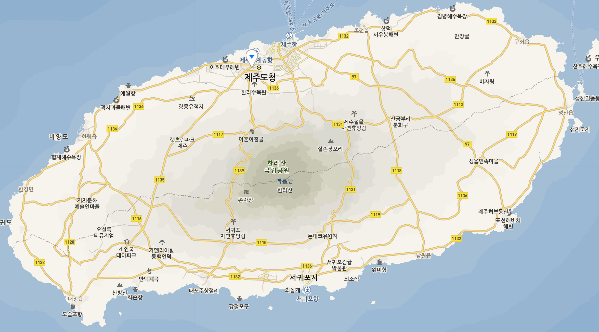

## 가족여행 2월 19 ~ 21일 계획서

### 숙방시설

* 호텔명 : 제주아마존호텔
* 홈페이지 : http://www.izonehotel.com
* 장소 : 제주시 연동 261-36 (신광로 4길 18)

* 룸사진

* 장소

### 19일 일정 (점심, 저녁)

* 광주팀 : 오전 9:20분 출발 ~ 10:05분 제주도착
* 서울팀 : 오전 9:30분 출발 ~ 10:35분 제주도착

1. 11시까지 광주팀, 서울팀 모임 및 차량렌트
2. 12시 점심식사
3. 

### 20일 일정 (아침, 점심, 저녁)

1. 난타공연
2. 

### 21일 일정 (아침, 점심)

* 광주팀 : 16:30분 출발 ~ 17:15분 광주공항도착
* 서울팀 : 16:20분 출발 ~ 17:25분 김포공항도착

### 일정 중 가고싶은 곳 모음

1. 성산일출봉
2. 휴애리: 감귤따기체험, 흑돼지공연
3. 소인국테마파크
3. 섭지코지
4. 산굼부리
5. 애월 해안도로 드라이브
6. 중문단지관광(여미지식물원, 천제연폭포, 돌고래쇼, etc)

### 일정 중 먹고싶은 음식

1. 제주은갈치회
2. 해산물요리
3. 똥돼지고기
4. 
