## 가족여행 2월 19 ~ 21일 계획서

### 숙방시설

* 호텔명 : 제주아마존호텔
* 홈페이지 : http://www.izonehotel.com
* 장소 : 제주시 연동 261-36 (신광로 4길 18)

* 룸사진


* 장소, 제주공항에 가까운 제주도청 근처이네요 제주도 북쪽

### 19일 일정 (점심, 저녁)

* 광주팀 : 오전 9:20분 출발 ~ 10:05분 제주도착
* 서울팀 : 오전 9:30분 출발 ~ 10:35분 제주도착

> *서울팀은 김포공항 8시반까지 집결 (매형집, 강춘집, 우영집) 바랍니다.*

1. 11시까지 광주팀, 서울팀 모임 및 차량렌트
2. 12시 점심식사

```cmd
일정계획 미정 의견들 주세요.
```

### 20일 일정 (아침, 점심, 저녁)

```cmd
일정계획 미정 의견들 주세요.
```

1. 17:00 [S석] 난타예매, 예약번호 : 1502170346

### 21일 일정 (아침, 점심)

```cmd
일정계획 미정 의견들 주세요.
```

* 광주팀 : 16:30분 출발 ~ 17:15분 광주공항도착
* 서울팀 : 16:20분 출발 ~ 17:25분 김포공항도착

### 제주도 관광, 맛집, 숙박 이미지

지금까지 채팅에서 오간 장소를 정리하였습니다. 내일까지 추가적으로 업그레이드 예정이니 소중한 의견들 주시기 바랍니다.

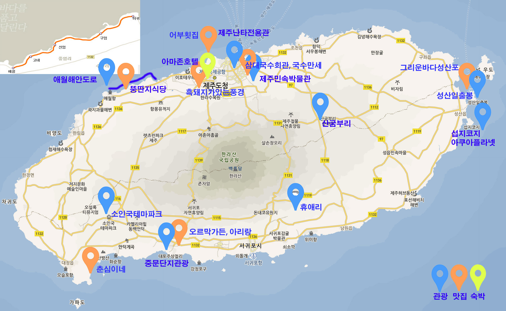


### 일정 중 가고싶은 곳 모음

1. 성산일출봉
> 성산일출봉은 일출이 아름답기로 유명한 곳으로 일출명소 중 하나 이며, 제주여행코스 중 꼭 가봐야할 여행지 중 하나이기도 합니다. 입장료는 성인기준 2천원이며, 천연기념물 제 420호 라고 하네요. 
> 
> 너무 계단이 많아, 어머니는 무리일거 같네요. ㅎ

2. 휴애리: 감귤따기체험, 흑돼지공연, 승마체험 etc
> 입장시간 : 09:00 ~ 17:00 연중무휴 폐장 18:00, 동절기 16:30 마감
> 전화문의 : 064-732-2114
> 이용요금 : 성인 11,000원, 청소년 9,000원, 어린이 8,000원, 승마체험 10,000원, 감귤체험 5,000원, 65세 이상 경로우대(신분증 제시)
> 
> 휴애리는 자연생활공원으로 2월에는 매화축제 (지금2월인데 가능한가.) 9월~3월(감귤따기체험), 12월 군고구마체험이 있으며, 흑돼지야 놀자, 승마체험, 동물먹이주기체험, 곤충태마관 등으로 이루어져 있다고 합니다. 매화축제와 감귤따기, 흑돼지야 놀자, 승마체험 등이 가능하겠네요.. 승우는 무얼좋아 할까 ㅎㅎ
> 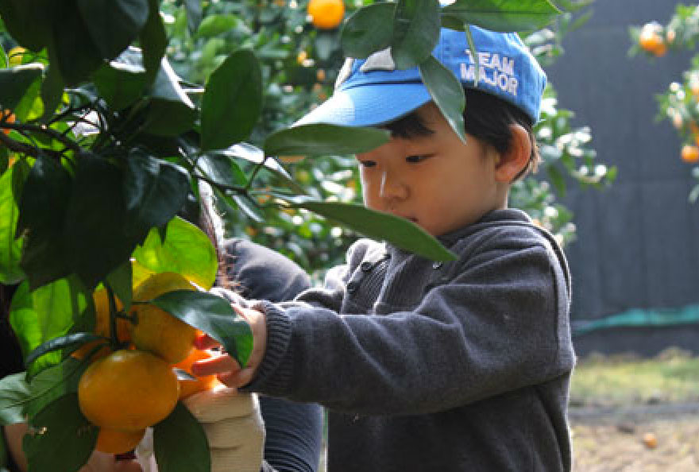
> 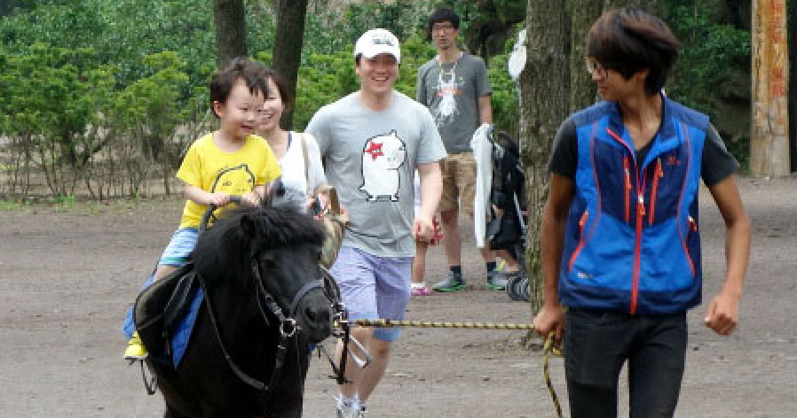

3. 소인국테마파크
> 이용요금 : 어른 9,000, 청소년 7,000, 어린이 5,000원
> 입장 08:30 일몰 1시간 전마감.
> 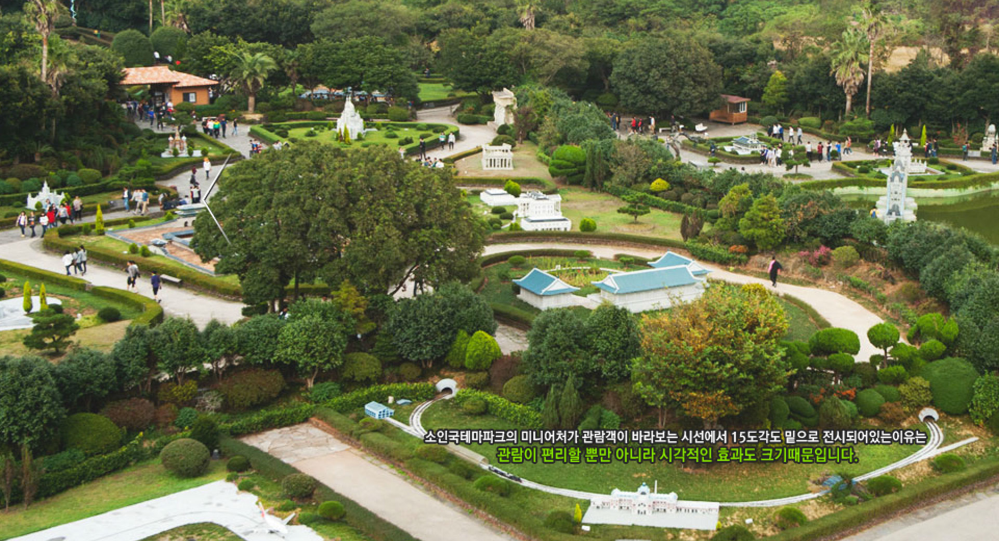

4. 섭지코지
> 제주특별자치도 동쪽 해안에 볼록 튀어나온 섭지코지는 봄철이면 노란 유채꽃과 성산 일출봉을 배경으로한 아름다운 해안풍경이 일품입니다. 들머리의 신양해변백사장, 끝머리 언덕위 평원에 드리워진 유채밭, 여유롭게 풀을 뜯는 제주조랑말들, 그리고 바위로 둘러친 해안절벽과 우뚝 치솟은 전설어린 선바위 등은 전형적인 제주의 아름다움을 만날 수 있는 곳입니다. 특히 제주의 다른 해안과는 달리 '송이'라는 붉은 화산재로 되어 있고, 밀물과 썰물에 따라 물속에 잠겼다가 일어서는 기암괴석들은 어디에서도 볼 수 없는 자연의 수석전시회를 연출합니다.
>
> 영화.드라마 촬영지 : 단적비연수, 이재수의 난, 천일야, 올인 - 영화 단적비연수에서 최진실이 살았던 그림같은 푸른 바닷가의 집이 이곳을 배경으로 하고 있으며, 2003년 TV드라마「올인」촬영셋트장으로 유명해진 섭지코지는 협자연대가 있으며 등대가 자리잡고 있어 평소에도 많은 관광객이 즐겨 찾는 곳이기도 합니다.
> 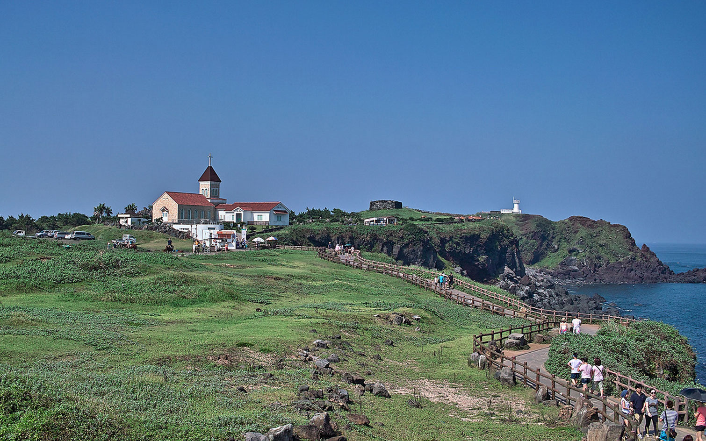

5. 산굼부리
> 이용요금 : 어른 6,000원, 청소년,어린이,노인 3,000원
> 굼부리란 화산체의 분화구를 가리키는 제주말이다. 산위나 중턱에 둥그렇게 움푹팬 환형의 것도 있고 신체의 한쪽사면이 도려내진 듯이 벌어진 말굽형도 있으며, 양자를 아울러 가진 복합형 화산체도 있다. 그 모양이나 크기에 상관없이 이를 굼부리라고 하고 지역에 따라서 움부리라고도 한다.
> 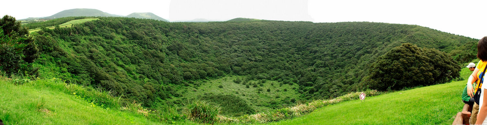

6. 애월 해안도로 드라이브
> 제주도에서 전망 좋은 애월해안도로 드라이브코스로 좋음.
> 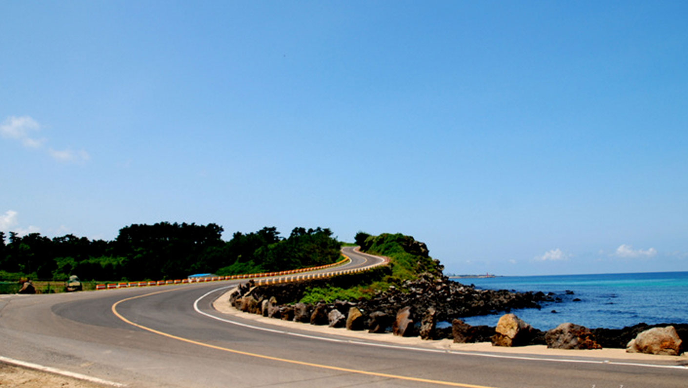
> 

7. 중문관광단지(여미지식물원, 천제연폭포, 돌고래쇼, etc)
> 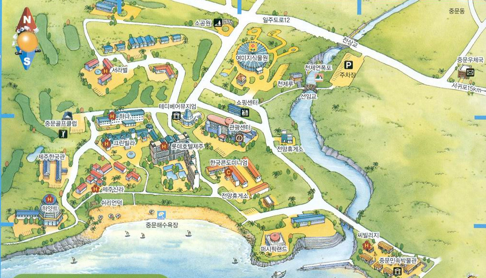

8. 제주민속자연사 박물관
> 볼거리가 별로 없어 적지 않습니다.

9. 난타전용관공연관람
> 난타공연 볼만하겠죠...
> 

10. 제주 아쿠아플라넷 수족관
> 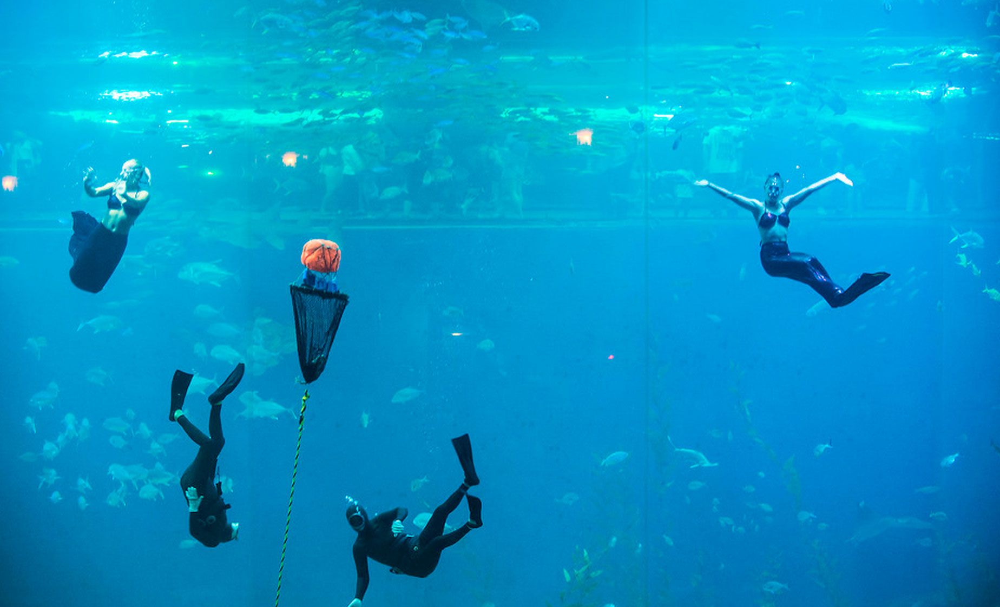

### 일정 중 먹고싶은 음식

1. **삼대국수회관**, 제주 고기국수 맛집,  제주시 일도 2동 1045-12, 064-759-6644
근처에 제주 민속자연사 박물관이 있음
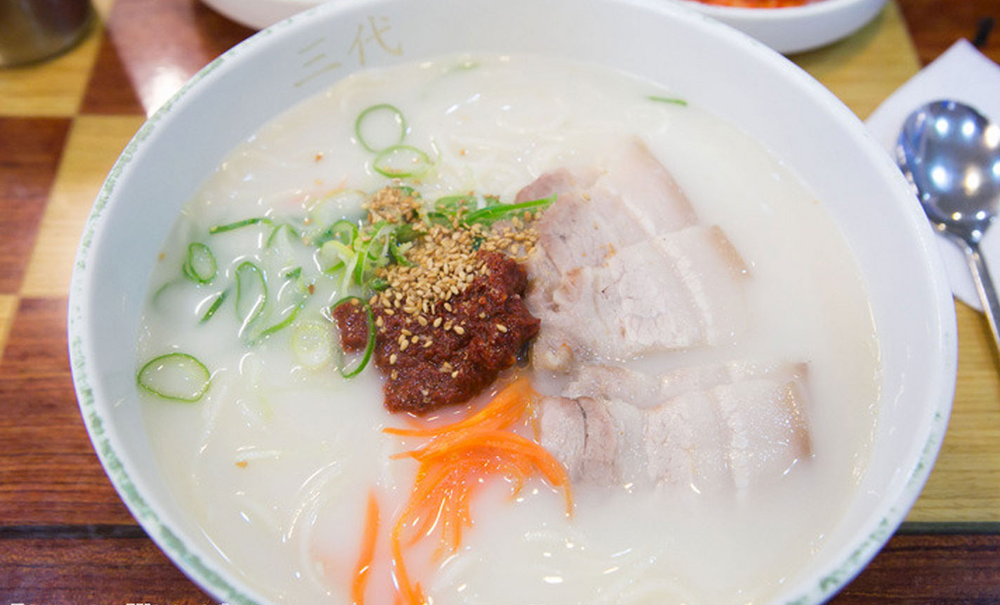
블로그:http://blog.daum.net/wirbel/15523195

2. **춘심이네**, 해물, 생선요리, 은갈치회, 은갈치구의, 서귀포시 대정읍 상모리 131-3, 064-794-4010
중문단지관광지가 가까움.
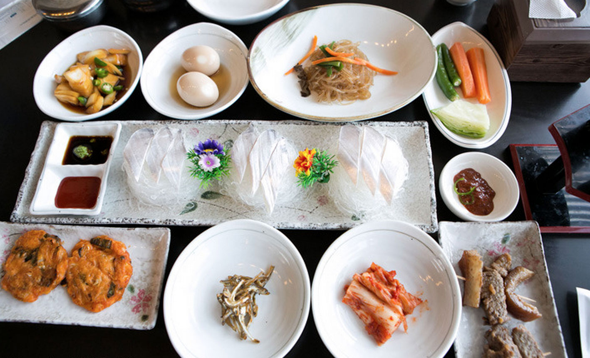
블로그:http://blog.daum.net/wirbel/15523198

3. **흑돼지가있는풍경**, 제주도 흑돼지 맛집, 제주시 진군남 4길 7-8, 0640-742-1108
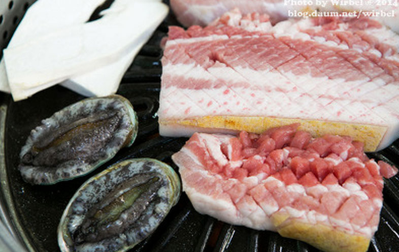
블로그:http://blog.daum.net/wirbel/15523205

4. 뚱딴지식당, 애월해안도로에 위치한 뚱딴지식당 "활오복탕", 애월읍 신엄리 2814-1, 064-799-2085

블로그 : http://www.ejeju.com/_APP/bbs/board.php?bo_table=TC_aftertour&wr_id=28586

5. 그리운바다성산포, 고등어회,은갈치회, 서귀포시 성산읍 성산리 360-10, 064-784-2128
성산일출봉과 함께하면 좋겠네, 그리고 네이버블로그 의견이 모두좋네요, 문재인 의원 사진도 있네요. ㅎㅎ
블로그 : http://blog.naver.com/phs001028

6. 오르막가든, 흑돼지고기 전문, 중문관광단지 근처, 서귀포시 대포동 743-3, 064-738-7755
네이버 블로그 의견이 좋음, 흑돼지도 판매

블로그 : http://blog.daum.net/jejumooni/638

7. 아리랑, 흑돼지고기 전문, 중문관광단지 근처, 서귀포시 중문동 1799-7, 064-738-6800
네이버 블로그 의견 좋으나 위보단 못함. 그러나 식당규모가 커보임.

	블로그 : http://m.blog.naver.com/01x855x/220230576651

8. 국수만세, 고기국수 전문점, 제주시 오라1동 1083-2, 064-702-7056
제주공항 근처이고, 크기는 작음, 삼대국수회관보다 블로그 의견이 좋음.

	블로그 : http://wewant.tistory.com/85

9. 어부횟집, 제주도 횟집, 제주시 용담3동 2363, 064-711-7742
제주공항 근처이고, 제주도 위치 다금바리, 갯돔, 참돔 및 고등어, 갈치회, 모듬회 등 활어전문 횟집.

	블로그 : http://blog.daum.net/itasy/272

10. 백성원해장국, 해장국집, 제주시 이도2동 1176-114, 064-724-0792
제주시청 근처, 네이버에 의견이 좋음. 해장국전문점 제주도까지 와서 이걸먹어야 되나 ㅎㅎ

	블로그 : http://blog.daum.net/jejumooni/828

11. 대들보, 제주도 서귀포시 중문동 위치, 갈비찜 전문업체, 김치찜, 만두, 갈치, 고등어 등 메뉴, 서귀포시 중문동 1489-2, 064-738-6266

	블로그 : http://blog.daum.net/dlwls2345/71


Write by Skc.