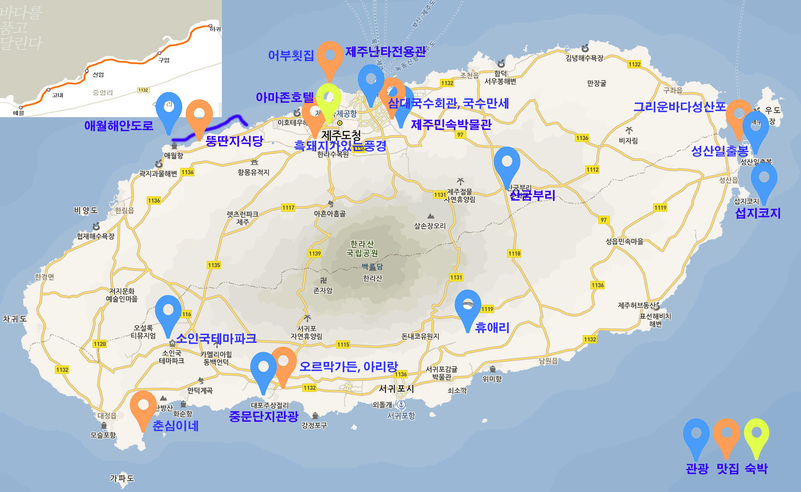

## 가족여행 2월 19 ~ 21일 계획서

### 숙방시설

* 호텔명 : 제주아마존호텔
* 홈페이지 : http://www.izonehotel.com
* 장소 : 제주시 연동 261-36 (신광로 4길 18)

* 룸사진

* 장소, 제주공항에 가까운 제주도청 근처이네요 제주도 가운데 북쪽

### 19일 일정 (점심, 저녁)

* 광주팀 : 오전 9:20분 출발 ~ 10:05분 제주도착
* 서울팀 : 오전 9:30분 출발 ~ 10:35분 제주도착

1. 11시까지 광주팀, 서울팀 모임 및 차량렌트
2. 12시 점심식사 

### 20일 일정 (아침, 점심, 저녁)

### 21일 일정 (아침, 점심)

* 광주팀 : 16:30분 출발 ~ 17:15분 광주공항도착
* 서울팀 : 16:20분 출발 ~ 17:25분 김포공항도착

### 제주도 관광, 맛집, 숙박 이미지

지금까지 채팅에서 오간 장소를 정리하였습니다. 내일까지 추가적으로 업그레이드 예정이니 소중한 의견들 주시기 바랍니다.

### 일정 중 가고싶은 곳 모음

1. 성산일출봉
2. 휴애리: 감귤따기체험, 흑돼지공연
3. 소인국테마파크
3. 섭지코지
4. 산굼부리
5. 애월 해안도로 드라이브
6. 중문단지관광(여미지식물원, 천제연폭포, 돌고래쇼, etc)
7. 제주민속자연사 박물관

### 일정 중 먹고싶은 음식

1. **삼대국수회관**, 제주 고기국수 맛집,  제주시 일도 2동 1045-12, 064-759-6644
근처에 제주 민속자연사 박물관이 있음

블로그:http://blog.daum.net/wirbel/15523195

2. **춘심이네**, 해물, 생선요리, 은갈치회, 은갈치구의, 서귀포시 대정읍 상모리 131-3, 064-794-4010

블로그:http://blog.daum.net/wirbel/15523198

3. **흑돼지가있는풍경**, 제주도 흑돼지 맛집, 제주시 진군남 4길 7-8, 0640-742-1108

블로그:http://blog.daum.net/wirbel/15523205

4. 뚱딴지식당, 애월해안도로에 위치한 뚱딴지식당 "활오복탕", 애월읍 신엄리 2814-1, 064-799-2085

블로그 : http://www.ejeju.com/_APP/bbs/board.php?bo_table=TC_aftertour&wr_id=28586
